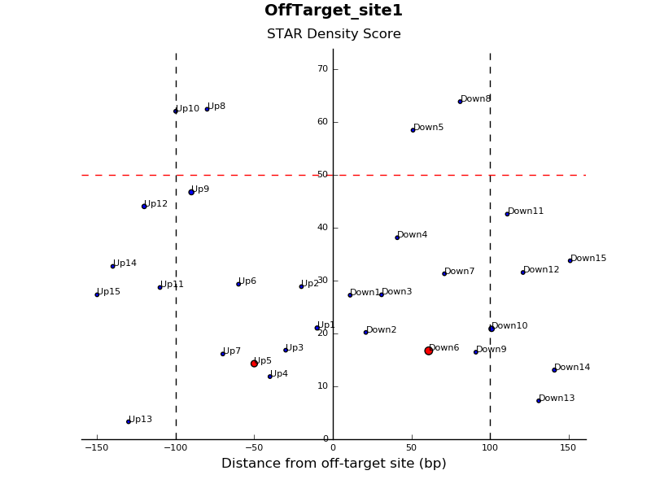

# Oligo Design - CRISPR off-target
`Description` 
This pipeline will generate oligos for performing Capture-C adjacent to predicted off-target cut sites of CRISPR. The user supplies a bed file containing the predicted off-target sites and oligos are generated in a step-wise manner walking away from the cut site in order to obtain
the most efficient oligos within a required distance. The user can specify the oligo size, step size and maximum distance away from the cut site that the oligos are designed within.

`Input` 
The pipeline can be run by supplying OT_Pipe.sh with the variables <b>-b</b> \<bed file\> <b>-g</b> \<genome\> <b>-o</b> \<oligo size (bp)\> <b>-s</b> \<step size (bp)\> and <b>-d</b> \<maximum distance from cut site (bp)\>. 
<b>-b</b> supply the file name of a 4-column (Chr, Start, Stop, Name) bed file containing predicted off-target sites 
<b>-g</b> select from <b>hg18</b>, <b>hg19</b>, <b>hg38</b>, <b>mm9</b> and <b>mm10</b> 
<b>-o</b> choose the size of the oligos (in bp) to be generated 
<b>-s</b> choose the step size (in bp) to specify the distance between adjacent oligos that are generated 
<b>-d</b> choose the maximum distance (in bp) away from the off-target site to design oligos 

<b>-h</b> print extended help and exit script 

Example run for 50bp oligos generated in a 10-bp stepwise manner no further than 200bp away from the off-target site, on either side (i.e. a maximum possible window of 400bp), for human hg19:  
<b>bash OT_Pipe.sh -b OffTargetSites.bed -g hg19 -o 50 -s 10 -d 200</b>  
All supplied arguments are case sensitive

`Output` 
The pipeline generates two output text files with oligo information: 1) <b>AllOligos_Info.txt</b> 2) <b>FilteredOligos_Info.txt</b>.
Both files contain information about the oligos, including density of STAR mapping, the presence of repeats, and the GC%, however, FilteredOligos_Info.txt only contains information about oligos that pass the STAR density and repeat length filter.
A graphical display of the oligo scores can be generated by running the OT_Graph.py script. The script must be supplied with the oligo info file (either AllOligos_Info.txt or FilteredOligos_Info.txt) and the name of the predicted off-target site that was supplied in the fourth column of the bed file.
As an example:  
<b>python OT_Graph.py -o AllOligos_Info.txt -s rs10546732.1</b>  
This will generate a graph displaying the STAR density score of each oligo for that off-target site (only the ones that pass the filter if FilteredOligos_Info.txt is supplied to the script), against the distance from the off-target site.
The repeat length is represented by the size of the plotted point: a bigger data point represents a sequence with a longer repeat sequence in it. Oligos where the repeat sequence is longer than the filter cut-off are displayed in red as opposed to blue.
The graphical display provides an easier way for the user to select the most efficient oligos for a given off-target site, taking into account these three important properties. 

`Under the hood` 
Below is a breakdown of the pipeline workflow.  
<b>Workflow of OT_Pipe.sh</b>
<table>
    <tr>
        <th>Order</th>
        <th>Script/Process</th>
        <th>Description</th>
    </tr>
    <tr>
        <td align="center">1</td>
        <td>OT_OligoGen.py</td>
        <td>Generates coordinates of oligos, walking out from predicted CRISPR off-target cut site, based on parameters supplied by the user</td>
    </tr>
    <tr>
        <td align="center">2</td>
        <td>fastaFromBed (bedtools)</td>
        <td>Extracts the sequences of the coordinates generated from OT_OligoGen.py and returns them in FASTA format</td>
    </tr>
    <tr>
        <td align="center">3</td>
        <td>STAR</td>
        <td>Aligns FASTA sequences from step 2 against the reference genome</td>
    </tr>
    <tr>
        <td align="center">4</td>
        <td>RepeatMasker</td>
        <td>Checks for the presence of simple sequence repeats in FASTA sequences from step 2</td>
    </tr>
    <tr>
        <td align="center">5</td>
        <td>OT_STAR.py</td>
        <td>Determines overall off-target binding potential of the oligo sequences from step 2, using information from STAR and RepeatMasker</td>
    </tr>
</table>

