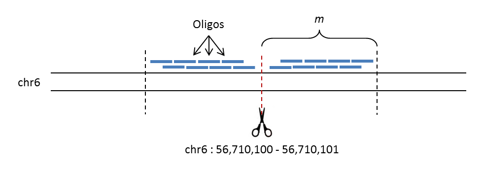

#################
CRISPR Off-Target
#################

.. container:: subtitle

    off_target.py

Functions: :func:`gen_oligos() <off_target.gen_oligos>`

Description
===========

.. automodule:: off_target
   :platform: Unix
   
The image below shows a schematic of how `off_target` designs oligos in step-wise manner, walking away from a potential CRISPR off-target cut site; in this example the user has supplied an off-target site at the position chr6:56710100-56710101. The first oligo on either
side is designed 10bp away from the cut-site, with adjacent oligos being designed a user-specified number of base-pairs (step size) further out, up until a specified maximum distance (`m`). Unlike the other pipelines, the intention is for only one oligo from each side of the off-target site
to be used, based on the efficiency readouts shown in the output file `oligo_info.txt` (see :ref:`Choosing Good Oligos <filtering>` for more information).

    Schematic of oligo design by `off_target`
    
The unpredictability of indel mutations following CRISPR-mediated digestions should be taken into consideration since deletion of the expected oligo hybridisation region could occur. Moreover, oligos should not be designed too far away from the cut-site in order
to maintain an efficient pull-down of the region. Due to these points, we recommend trying a few combinations of pairs at different distances, for optimisation.

.. note::
    
    For full functionality, `off_target` should be run from the command line in order to test the efficiency of the generated oligos. This involves a pipeline that incorporates functions from the :doc:`tools <tools>` module.
    
Usage
=====

When run from the command line, `off_target.py` takes the following parameters:

.. option:: -h, --help
    
    (flag) Show this help message and exit
    
.. option:: -f <reference fasta>, --fasta <reference fasta>
    
    (str) The path to the reference genome fasta
    
.. option:: -g <genome>, --genome <genome>

    ({mm9, mm10, hg18, hg19, hg38}) The name of the genome build
    
.. option:: -b <bed file>, --bed <bed file>

    (str) The path to the :ref:`bed file <bed-file>` containing the coordinates of the expected CRISPR off-target cleavage sites
    
.. option:: -t <step size>, --step_size <step size>

    (int, optional) The number of base-pairs between the start coordinates of adjacent oligos (:ref:`see below <step>`), default=10
    
.. option:: -o <oligo length>, --oligo <oligo length>

    (int, optional) The length (bp) of the oligos to design, default=70
    
.. option:: -m <maximum distance>, --max_dist <maximum distance>

    (int, optional) The maximum distance away from the off-target site to design oligos to, default=200
    
.. option:: -s <STAR index>, --star_index <STAR index>

    (str) The path to the STAR index directory; omit this option if running with BLAT (:option:`--blat`)
    
.. option:: --blat

    (flag) Detect off-target binding using :ref:`BLAT instead of STAR <star-blat>`
    
Examples
--------

Below are examples using the `off_target` pipeline for different scenarios

.. code-block:: bash
    :caption: 100bp oligos using the hg18 build, walking out from the off-target sites 50bp at a time up until 300bp away, using BLAT to check off-target binding

    python off_target.py -f ~/hg18/Sequence/genome.fa -g hg18 -b off_target_sites.bed -o 100 -t 50 -m 300 --blat
    
.. code-block:: bash
    :caption: 50bp oligos using the mm10 build, walking out from the off-target sites 10bp at a time up until 200bp away, using STAR to check off-target binding

    python off_target.py -f ~/mm10/Sequence/genome.fa -g mm10 -b ms_off_targets.bed -o 50 -s ~/mm10/STAR/
    
Functions
=========

As well as being run as a full pipeline from the command line, the `oligo` modules have been written such that the individual functions can be easily run in a python shell. The pipeline runs the functions in the following order:

#. :func:`off_target.gen_oligos`
#. :func:`tools.write_oligos`
#. :func:`tools.check_off_target`
#. :func:`tools.get_density`

Below is a detailed list of functions in the `off_target` module:

.. autofunction:: gen_oligos

.. centered:: :doc:`Top of Page <off_target>`
