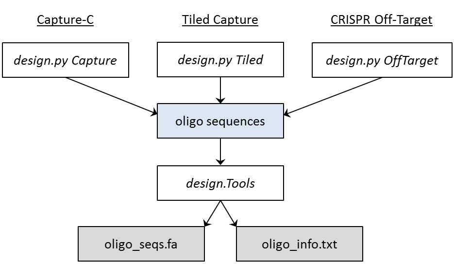
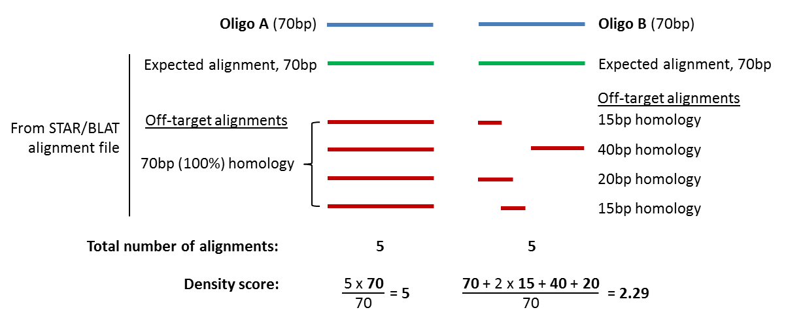

########
Overview
########

Capture Oligo Design
====================

``oligo`` provides functionality to automate primer design for DNA capture experiments, providing the user with details about efficiency of the primers generated.

.. include:: ../README.rst
    :start-line: 11
    :end-line: 65

.. include:: ../README.rst
    :start-line: 68

.. important::

    Paths to directories containing executables for STAR, BLAT and RepeatMasker must be set in the `config.txt` file before using the pipelines

More detailed usage information can be found in the individual pages, via the navigation on the left. A schematic of the pipeline workflows is shown below.

    
    Workflows of the three pipelines

Output
======

Although a number of files, including alignment files, are output from the pipelines, the important one is `oligo_info.txt`. This is a tab-delimited text file that contains the following information for every oligo:

**chr**
    the chromsome that the oligo/fragment is on
**start**
    the bp start coordinate of the oligo
**stop**
    the bp stop coordinate of the oligo
**fragment_start**
    the bp start coordinate of the fragment
**fragment_stop**
    the bp stop coordinate of the fragment
**side_of_fragment**
    the side of the fragment that the oligo is situated on (left or right)
**sequence**
    the full DNA sequence of the oligo
**total_number_of_alignments**
    the total number of times the oligo was found in the BLAT/STAR alignment file
**density_score**
    the base-pair average and length-normalised number of times the oligo was found in the BLAT/STAR alignment file (see :ref:`Choosing Good Oligos <filtering>` for more details)
**repeat_length**
    the length of the longest simple sequence repeat found in the oligo
**repeat_class**
    the class of the longest simple sequence repeat found in the oligo
**GC%**
    the GC percentage of the oligo sequence
**associations**
    the position/gene name associated with this oligo; this is the viewpoint name supplied in the bed file (4th column)

Missing Values
--------------

Due to particular differences between the three pipelines, and in order to keep a consistent output format between the three, there are instances where some values in the file will be purposefully missing.

**fragment_start, fragment_stop, side_of_fragment**
    These values will be replaced with a '.' for the Tiled Capture pipeline when run in contiguous mode, and for the CRISPR Off-Target pipeline, as both of these pipelines are restriction fragment-independent
**associations**
    This value will be replaced with a '.' for the Tiled Capture pipeline as these oligos are generated for adjacent sites across one large region and not for different viewpoints associated with unique names

.. _filtering:

Choosing Good Oligos
====================

.. note::

    Cut-offs for efficient oligos:

    | 1 <= **density_score** <= 30 (if using BLAT)
    | 1 <= **density_score** <= 50 (if using STAR)
    | **repeat_length** <= oligo_length/4

Density Score
-------------

When performing a Capture experiment it is important that the oligo is not susceptible to off-target binding as this would result in the pulldown of unwanted material, generating false positives. To assess the degree of off-target binding, each oligo is aligned against the
genome using either STAR or BLAT (for information on choosing between STAR or BLAT see any of the individual pipeline :ref:`documentation <star-blat>`). The number of times an oligo aligns to the genome is used to assess its degree of off-target binding and this value is represented by the density score. Density score is calculated by counting the base-pair coverage of each alignment for an oligo
and dividing that value by the length of the oligo. A schematic of this calculation is shown below, for two 70bp oligos.

Therefore, a lower density score is better, with the exception of values below 1. A value between 0 and 1 means no perfect alignment was found so the pulldown will not be 100% efficient. A score of 0 means that either no alignments were found so this oligo will not capture
anything or, in the case of using STAR, can also mean that it aligned so many times that it passed the threshold for a read to be ignored, and hence would have a high degree of off-target binding. A safe cut-off for density score, to ensure efficient oligo capture without
problematic off-target binding, is greater than or equal to 1 and less than or equal to 30 (if using BLAT), or greater than or equal to 1 and less than or equal to 50 (if using STAR).

Repeat Length
-------------

The presence of simple sequence repeats in an oligo can also cause a greater degree of off-target binding due to the ambiguous presence of these repeats throughout the genome. Usually if an oligo has a long repeat within it, it will also have a high density score. However, it
is still best to filter on repeat length as well. We filter for oligos that have a repeat length less than or equal to a quarter of the length of the oligo, so for an 80bp oligo only those with a repeat length less than or equal to 20 would be accepted. Unlike density score,
0 is the best value as this means that the oligo does not contain any simple sequence repeats.

.. centered:: :doc:`Top of Page <overview>`
    