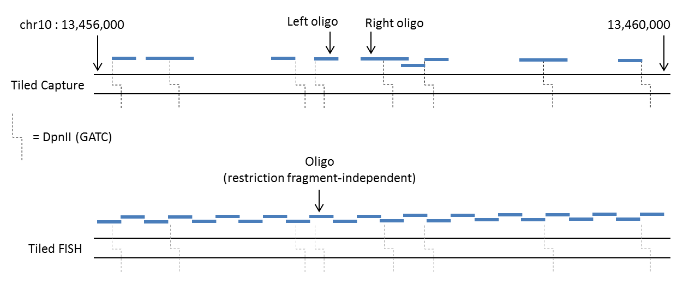

#############
Tiled Capture
#############

.. container:: subtitle

    tiled.py

Functions: :func:`gen_oligos_capture() <tiled.gen_oligos_capture>`, :func:`gen_oligos_fish() <tiled.gen_oligos_capture>`

Description
===========

.. automodule:: tiled
    :platform: Unix
    
The image below shows a schematic of how `tiled` designs oligos when run in either the default mode (top) or FISH mode (bottom). In the top panel the user has run `tiled` supplying the region chr10:13456000-13460000 and the restriction enzyme
DpnII. In the bottom panel the same coordinates have been used but with the :option:`--fish` flag, and the step size set to equal the oligo length, thereby generating end-to-end oligos. For Tiled FISH, the design is completely independent of
any restriction enzyme recognition sequences, however the DpnII sites have been left on the image for consistency.

    Schematic of oligo design by `tiled`, in default (top) and FISH (bottom) modes
    
It is possible for the Tiled Capture oligos to overlap, up to within 1bp of each other, when the restriction fragment is less than twice the length of the oligo. If the specified region consists of a fragment with length less than the specified oligo length, no oligos will be generated for that fragment.
If the fragment length exactly equals the oligo length, only one oligo will be generated. Similarly, in Tiled FISH, oligos can be designed such that they overlap up to within 1bp of each other; in this case, the step size would be set to 1.

.. note::
    
    For full functionality, `tiled` should be run from the command line in order to test the efficiency of the generated oligos. This involves a pipeline that incorporates functions from the :doc:`tools <tools>` module.

Usage
=====

When run from the command line, `tiled.py` takes the following parameters

.. option:: -h, --help
    
    (flag) Show this help message and exit
    
.. option:: --fish

    (flag) Run the pipeline in :ref:`FISH mode <fish>`
    
.. option:: -f <reference fasta>, --fasta <reference fasta>
    
    (str) The path to the reference genome fasta
    
.. option:: -g <genome>, --genome <genome>

    ({mm9, mm10, hg18, hg19, hg38}) The name of the genome build

.. option:: -c <chromsome>, --chr <chromosome>

    (str) The number/letter of the chromosome on which to design oligos
    e.g. 7 or X
    
.. option:: -r <region>, --region <region>

    (str, optional) The region in which to design the oligos; must be in
    the format 'start-stop' e.g. 10000-20000; omit this
    option to design oligos across the entire chromosome
    
.. option:: -e <enzyme>, --enzyme <enzyme>

    ({DpnII, NlaIII, HindIII}, optional) Name of the :ref:`restriction enzyme <enzyme>` to be used
    for fragment digestion, default=DpnII; omit this option if running in FISH mode (:option:`--fish`)
    
.. option:: -o <oligo length>, --oligo <oligo length>

    (int, optional) The length (bp) of the oligos to design, default=70
    
.. option:: -t <step size>, --step_size <step size>

    (int, optional) The number of base-pairs between the start coordinates of adjacent oligos (:ref:`see below <step>`), when running in
    FISH mode (:option:`--fish`), default=70; omit this option if you are not using
    the :option:`--fish` flag
    
.. option:: -s <STAR index>, --star_index <STAR index>

    (str) The path to the STAR index directory; omit this option if running with BLAT (:option:`--blat`)
    
.. option:: --blat

    (flag) Detect off-target binding using :ref:`BLAT instead of STAR <star-blat>`
    
Examples
--------

Below are examples using the `tiled` pipeline for different scenarios

.. code-block:: bash
    :caption: 120bp oligos for DpnII fragments in hg38 for the whole of chromsome 18, using STAR to check off-target binding

    python tiled.py -f ~/hg38/Sequence/genome.fa -g hg38 -c 18 -o 120 -s ~/hg19/STAR/
    
.. code-block:: bash
    :caption: 50bp oligos across the region 10,150,000 to 10,200,000 on chromosome X of mm9, with adjacent oligos separated by a gap of 10bp, using BLAT to check off-target binding

    python tiled.py --fish -f ~/mm9/Sequence/genome.fa -g mm9 -c X -r 10150000-10200000 -o 50 -t 60 --blat
    
Specifics
---------

.. _fish:

**FISH** (:option:`--fish`)
    Running the pipeline in FISH mode no longer restricts oligo design to Capture-C specification and hence the oligos are designed independently of any restriction fragment or recognition sequence. Instead, the user defines a :ref:`step size <step>` (:option:`-t`, :option:`--step_size`)
    to design oligos within close proximity to each other, across a specified region (:option:`-r`, :option:`--region`) or entire chromosome
   
.. _enzyme:

**Restriction enzyme** (:option:`-e`, :option:`--enzyme`)
    The restriction enzyme being used in the Tiled Capture experiment (if not running in FISH mode). This determines the recogition sequence used to define the fragment boundaries and hence the starts and ends of the oligos. The current version supports `DpnII` (GATC), `NlaIII` (CATG) and `HindIII` (AAGCTT).
    If this option is omitted, `DpnII` will be used by default.
    
.. _step:

**Step size** (:option:`-t`, :option:`--step_size`)
    The step size option allows for overlapping oligos to be designed, if required. A step size of 1 for 70bp oligos will shift the next oligo just 1bp to the right so that two adjacent oligos will overlap by 69bp. To design exact end-to-end oligos, the step size must equal the
    oligo length (:option:`-o`, :option:`--oligo`)

.. _star-blat:

**STAR** (:option:`-s`, :option:`--star_index`) or **BLAT** (:option:`--blat`)
    To check for off-target binding, either the sequence aligner STAR or the BLAST-like Alignment Tool (BLAT) can be used. By default, STAR is used, unless `tiled.py` is run with the :option:`--blat` flag. Since BLAT is more widely used to detect off-target binding events, this might be preferred
    by the user. However, BLAT can be particulary slow for large designs, especially for the human reference genomes. STAR's exceptional speed is better suited for designs with >1000 oligos. If the :option:`--blat` flag is not selected, the path to the STAR index must be supplied
    after the :option:`-s` (or :option:`--star_index`) flag.
    
Functions
=========

As well as being run as a full pipeline from the command line, the `oligo` modules have been written such that the individual functions can be easily run in a python shell. The pipeline runs the functions in the following order:

#. :func:`tiled.gen_oligos_capture` OR :func:`tiled.gen_oligos_fish` (:option:`--fish`)
#. :func:`tools.write_oligos`
#. :func:`tools.check_off_target`
#. :func:`tools.get_density`

Below is a detailed list of functions in the `tiled` module:

.. autofunction:: gen_oligos_capture

.. autofunction:: gen_oligos_fish

.. centered:: :doc:`Top of Page <tiled>`
